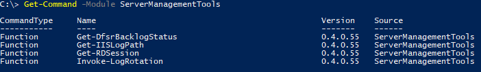

# Quick Start Guide

## Module Installation

If you have PowerShell 5+, or have the PowerShellGet module, simply use the `Install-Module` command.

```powershell
PS> Install-Module -Name ServerManagementTools
```

## Getting Started

Get a list of available commands

```powershell
PS> Get-Command -Module ServerManagementTools
```

[](images/QuickStart-GetCommand.png)

